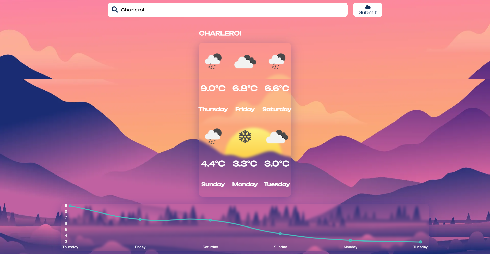

<br/>
<p align="center">
  <a href="https://github.com/manesjonathan/weather-app">
    
  </a>

  <h3 align="center">Weather app</h3>

  <p align="center">
    A simple weather app
    <br/>
    <br/>
    <a href="https://manesjonathan.github.io/weather-app.html">View Demo</a>
    .
    <a href="https://github.com/manesjonathan/weather-app/issues">Report Bug</a>
    .
  </p>
</p>

     

## About The Project



This repository contains a simple weather app done as part of my training at BeCode. This has been made from 12/21/2022 to 12/23/2022.

## Built With

- HTML
- CSS
- Javascript
- Vite (Bundler)


## Getting Started

To get a local copy up and running follow these simple example steps.

### Prerequisites

- VSC
- API Key

### Installation

1. Get a free API Key at [https://openweathermap.org](https://openweathermap.org/api)

2. Clone the repo

```sh
git clone https://github.com/manesjonathan/weather-app.git
```

3. Enter your API in `config.js`

```JS
export const API_KEY = 'ENTER YOUR API';
```

## Usage

Open the index.html in Internet browser.


## Authors

* **[Jonathan Manes](https://github.com/manesjonathan/)** - *Web Developer @BeCode.org* - 

## Acknowledgements

* [BeCode.org](https://github.com/becodeorg/)